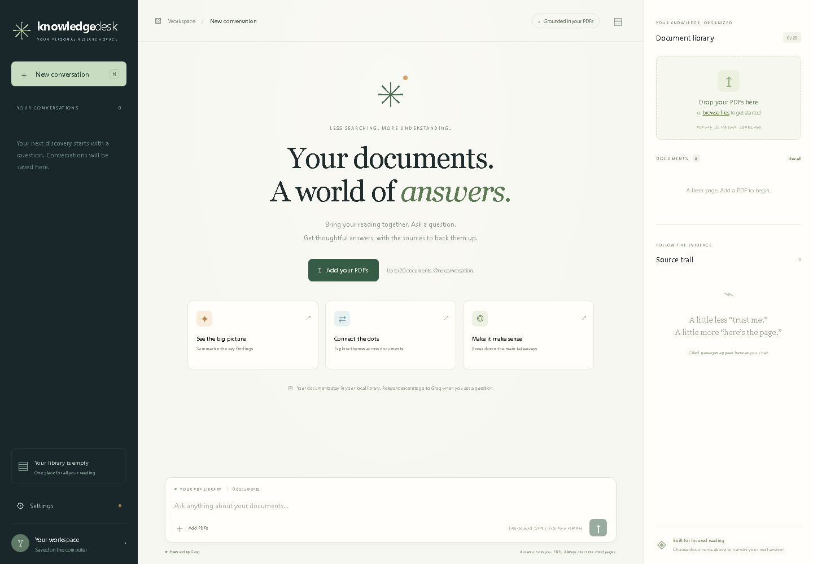
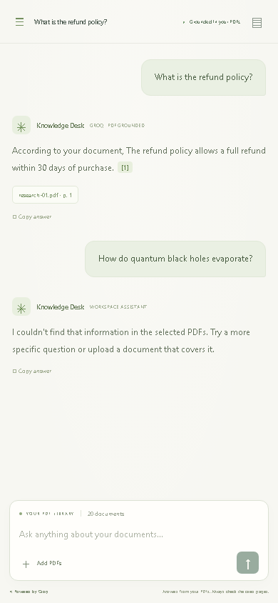

# Knowledge Desk · PDF RAG Chatbot

A focused research workspace for conversations with up to **20 PDFs**, powered by **Groq**. Upload documents, ask questions, inspect page citations, and return to saved conversations. Chats can be permanently deleted without deleting your PDF library.



## What you can do

- Upload or drag and drop up to 20 PDFs into a persistent local library.
- Ask questions across the library or select individual PDFs to narrow the answer.
- Read PDF-grounded answers with inline citations, quoted passages and links to original PDF pages.
- Reopen previous chats from the conversation sidebar; history survives service restarts.
- Delete a conversation and all its messages, or remove individual PDFs from future searches.
- Set a Groq API key in the Settings dialog, with no key returned by the API.
- Use the responsive interface on desktop and mobile.

## Run on Windows

Python 3.10 is recommended. From this project folder:

```powershell
py -3.10 -m venv .venv
.\.venv\Scripts\python -m pip install -r requirements.txt
.\run.ps1
```

Open **http://127.0.0.1:8016**. Add your PDFs, then open **Settings → Groq API key** to enable answers. A key entered in Settings stays in server memory for the current session; it is not written to disk. To configure it on startup instead:

```powershell
$env:GROQ_API_KEY = '<your Groq key>'
$env:GROQ_MODEL = 'openai/gpt-oss-120b'
.\run.ps1
```

The `.env.example` file documents environment names. It is not loaded automatically. Do not commit credentials.

Linux/macOS:

```bash
python3 -m venv .venv
source .venv/bin/activate
pip install -r requirements.txt
uvicorn app.main:app --host 127.0.0.1 --port 8016
```

## How the RAG pipeline works

1. `pypdf` extracts readable text page by page. Text is split into overlapping, page-preserving chunks.
2. SQLite stores original PDFs, chunks, chats and messages. Document uploads commit atomically; duplicates are detected by SHA-256.
3. Local word and character TF-IDF indexes retrieve relevant passages. No external embedding service is used. Generic summary requests sample a passage per selected document, so these are passage summaries rather than exhaustive summaries of every page.
4. Only retrieved passages and recent conversation context are sent to Groq's chat completions API. The instructions restrict answers to those passages and require inline citations.
5. Citation IDs are validated against retrieved sources before the answer is saved. Questions with no relevant matches receive an explicit refusal instead of an outside-knowledge answer.

Groq is the only hosted model provider. Retrieval is lexical, not a neural semantic embedding search: paraphrases with little shared vocabulary may need a more specific question. Citation validation checks source IDs, not whether every generated claim follows logically from its source. Check the original pages for important decisions.

PDF content is treated as untrusted data, never as instructions. The UI renders names, questions, answers and excerpts using text nodes rather than untrusted HTML.

## Limits and data handling

- Maximum **20 PDFs in the library**, with up to 20 in one upload.
- Maximum **20 MB per PDF**, **100 MB per batch**, **500 pages per PDF**, and two million extracted characters per PDF.
- Text-based PDFs are supported. Image-only scans need OCR before upload; password-protected PDFs need an unlocked copy.
- Original PDFs and conversations are stored under `data/knowledge.db`. Override with `RAG_DATA_DIR` before starting the service.
- Removing a PDF deletes its stored original and retrieval chunks. Past chat messages retain their saved quoted excerpts; original PDF links stop working for removed files.
- Deleting a conversation permanently deletes its messages. This does not delete PDFs.
- This is a single-user local workspace, bound to localhost. Add authentication and per-user storage before hosting it for multiple users.
- When asking a question, retrieved PDF excerpts and recent chat context are transmitted to Groq. Original PDF files are not uploaded to Groq.

## Tests

```powershell
.\.venv\Scripts\python -m pip install -r requirements-dev.txt
.\.venv\Scripts\python -m pytest -q
.\.venv\Scripts\python -m playwright install chromium
.\.venv\Scripts\python -m tests.browser_check
```

**36 backend tests passed**, plus **eight browser workflow checks** at desktop (1440 × 1000) and mobile (390 × 844) sizes. See [TEST_RESULTS.md](TEST_RESULTS.md) and [BROWSER_TEST_RESULTS.json](BROWSER_TEST_RESULTS.json).

Retrieval restores CamelCase word boundaries in joined PDF/OCR text and supports long keywords inside fused words. Conversational filler words are ignored and repeated topic matches help ranking. Filenames provide a topic hint, but answers must still be supported by retrieved page content. Documents with very little extracted text are flagged in the library as needing OCR. Greetings are handled without a model call.

Tests cover all 20 PDF slots, capacity/size limits, duplicates, invalid/scanned/encrypted PDFs, atomic uploads, retrieval filtering, page citations, source deletion, missing keys, saved chats, deletion cascades, and invalid Groq citations. Browser tests use actual PDF extraction and SQLite persistence with an isolated, mocked Groq response. Automated provider tests use mocks. The project owner also confirmed successful live Groq answers after switching to `openai/gpt-oss-120b`.

The app starts with an empty library. Test fixtures and conversations never enter your real workspace.

## Screenshots

<details><summary>Mobile interface</summary>



</details>

API documentation: **http://127.0.0.1:8016/docs**.

References: [Groq JSON output](https://console.groq.com/docs/structured-outputs), [Groq model documentation](https://console.groq.com/docs/models), [pypdf extraction and OCR limitations](https://pypdf.readthedocs.io/en/stable/user/extract-text.html).
